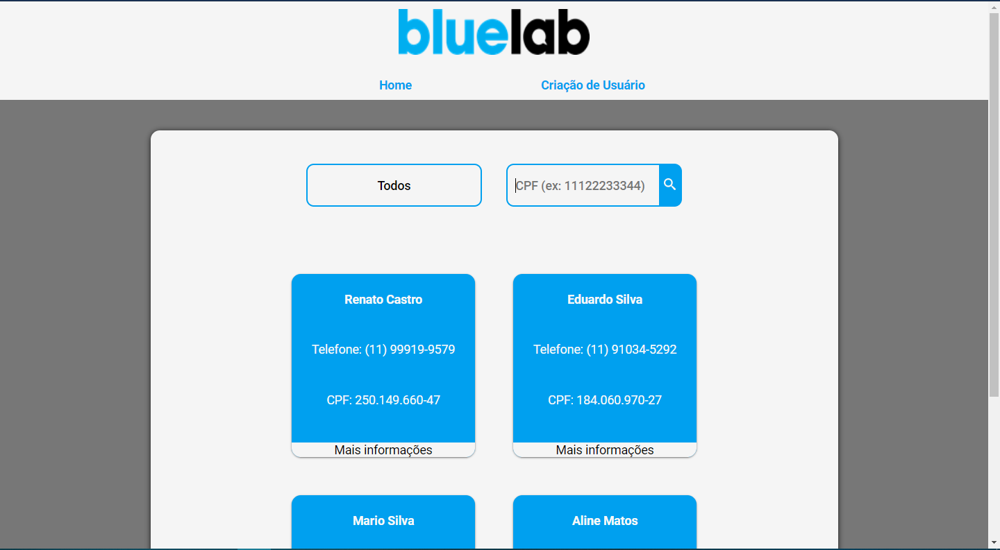
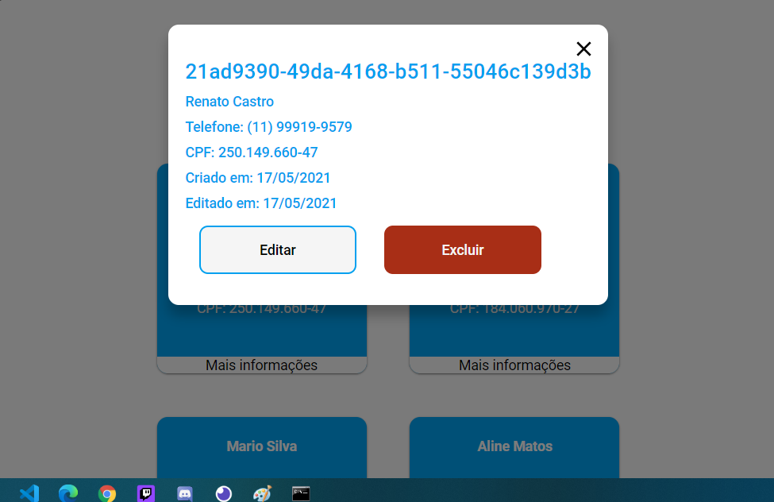
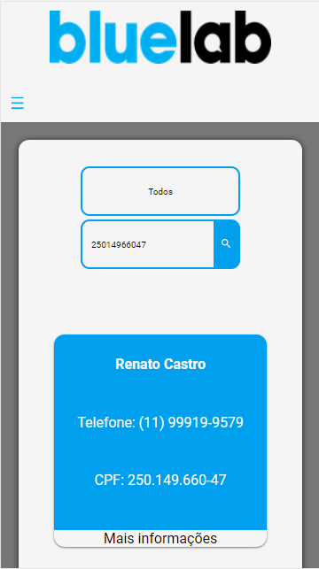
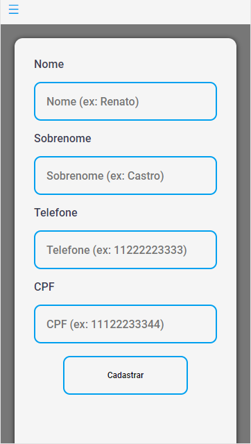

<h1 align="center">
    
</h1>

# Front-end do desafio da Bluelab

WebSite desenvolvido como parte do processo seletivo em que é necessário realizar um projeto fullstack.

## Sobre o site

O site foi desenvolvido com de forma que rode tanto em desktop como em mobile e apresenta logo na sua introdução, uma requisição da api feita no backend do projeto, trazendo informações básicas como nome, sobrenome, telefone e cpf.

<p align="center">
  
  
</p>

É possível fazer pesquisa por cpf de forma númerica, que posteriormente será convertido para exibição e verificar mais informações sobre o usuário, podendo editar e deletar.

<p align="center">
  
</p>

E por fim, é possível criar novos usuários, exigindo que nome, sobrenome, cpf e telefone sejam obrigatórios e moldados segundo as bibliotecas do Yup e do Validations-br, além de telefone e cpf serem únicos.

<p align="center">
  
</p>

Ainda é apresentável testes que ajudam a verificar se há vulnerabilidades e bugs.

## Dependências

Inicialmente é necessário você dar um:

```
npm install
ou
yarn
```

E depois rodar:

```
npm run start
ou
yarn start
```

Para rodar o site na porta 3000.

Para melhor visualização, é recomendado rodar o [backend](https://github.com/RenatoDTH/Desafio_Bluelab_Backend) da aplicação.

## Testes

Para rodar os testes, basta rodar:

```
npm run test
ou
yarn test
```

E o [Jest](https://jestjs.io/pt-BR/) vai rodar os testes básicos do site.

## Features

<ul>
<li> Menu que se transforma em menu hamburguer para mobile </li>
<li> Informações dinâmicas da api do backend</li>
<li> Modal</li>
<li> Loading com Lottie</li>
<li> Responsividade</li>
<li> Tratamento de erro e sucesso com Toasts!
<li> Criação de usuário
<li> Edição e exclusão de usuário
</ul>
